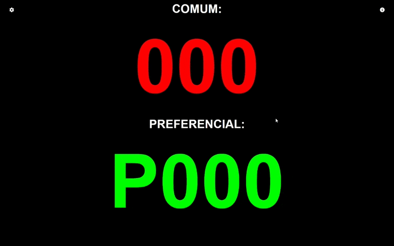

<div align="center">


</div>

# Painel de Senhas

Sistema de painel de senha, exibindo e gerenciando senhas. Ele permite controlar senhas comuns e preferenciais, avançar e retroceder de forma incremental, repetir a senha atual e alterar manualmente as senhas

Foi desenvolvido para atender a necessidades reais de atendimento, com arquitetura cliente-servidor e suporte a múltiplos painéis de atendimento.

Cada painel possui sua própria identificação e configurações. A identificação permite associar o painel ao ponto de atendimento correspondente.

A aplicação é dividida em duas áreas principais:

- **Painel de exibição:** destinado à apresentação em uma TV ou outro dispositivo de exibição, mostrando a senha chamada, o nome do painel e o histórico das últimas senhas chamadas.
- **Painel de controle:** utilizado para selecionar qual painel será manipulado e realizar as operações de controle das senhas, pipe e voz.

Cada painel possui configurações próprias, incluindo voz, bipe e atalhos de teclado.

A leitura das senhas utiliza os recursos de síntese de voz disponíveis no navegador do dispositivo responsável pela reprodução. Os alertas sonoros e demais configurações também podem ser ajustados individualmente para cada painel.

<div align="center">




</div>

## Utilização

### Arquitetura

A aplicação utiliza uma arquitetura cliente-servidor, desenvolvido em Node.js, responsável pelo processamento e pela comunicação entre os clientes.

Os dispositivos utilizados para exibição e controle podem acessar o sistema por meio de uma URL na rede.

A tela de exibição pode permanecer aberta na TV ou computador destinado à apresentação das chamadas, enquanto a tela de controle pode ser utilizada em outro dispositivo para realizar as operações sobre os painéis.

O serviço também pode ser executado de forma containerizada. Uma imagem Docker da aplicação está disponível no Docker Hub, permitindo utilizar o sistema sem a necessidade de configurar manualmente o ambiente de execução do servidor.

Para obter a imagem:

```bash
docker pull rtormente/ticket-panel:latest
```

### Painéis de atendimento

Cada painel possui uma identificação própria, utilizada para indicar o local ou finalidade do atendimento, como: recepção, triagem, entre outros.

Na tela de controle, o painel desejado é selecionado por meio de um campo de seleção. A partir dessa seleção, as operações de chamada e alteração de senha são direcionadas ao painel correspondente.

As configurações também são mantidas individualmente para cada painel.

### Controle de senhas

O sistema permite:

- Avançar a senha;
- Retroceder a senha;
- Repetir a senha atual;
- Alterar manualmente a senha;

As chamadas realizadas são refletidas automaticamente no painel de exibição correspondente.

### Histórico de chamadas

O painel de exibição apresenta, além da chamada atual, o histórico das últimas senhas chamadas com data e hora, permitindo acompanhar as chamadas realizadas anteriormente.

### Configurações

As configurações podem ser ajustadas individualmente para cada painel, incluindo:

- Voz;
- Bipe;
- Quantidade e características dos alertas sonoros;
- Atalhos de teclado.

Os atalhos das ações podem ser personalizados diretamente na interface de controle.

## Voz

A leitura das senhas utiliza a API `SpeechSynthesis` do navegador. As vozes disponíveis dependem do sistema operacional e do navegador utilizados pelo dispositivo responsável pela reprodução.

Em alguns ambientes Linux pode ser necessário instalar o pacote `speech-dispatcher` para disponibilizar recursos de síntese de voz.

As vozes disponibilizadas pelo `speech-dispatcher` podem apresentar uma qualidade bastante sintética e robótica. A instalação do pacote deve ser realizada no dispositivo que efetivamente irá reproduzir a voz do painel.

## Atalhos de teclado

Os atalhos das ações podem ser personalizados diretamente no painel de controle.

No Firefox, a tecla `/` pode ser utilizada pelo próprio navegador para a função de busca rápida. Caso seja atribuída a alguma ação do painel, o navegador poderá interceptá-la.

Nesse caso, recomenda-se utilizar outra tecla ou desabilitar a função de busca rápida do navegador.

## Licença

Este projeto está disponível sob a licença MIT.
